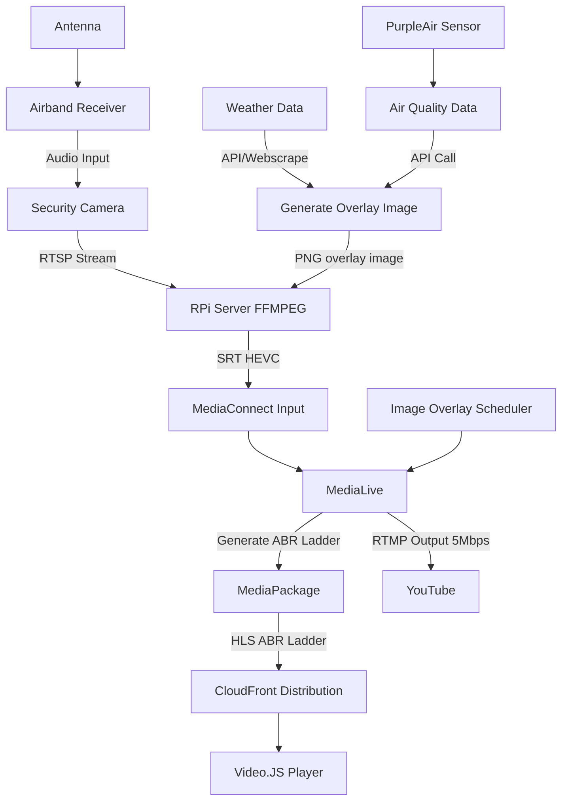

# airport-webcam
A simple webcam that overlays METAR and AQI data on video feed.

## Preview of Webcam
An example image from the webcam with METAR and AQI data overlayed on the video graphic

<picture>
  
</picture>

## Overview

