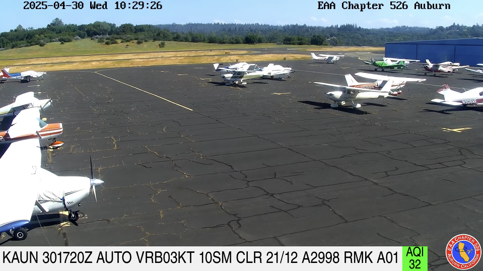
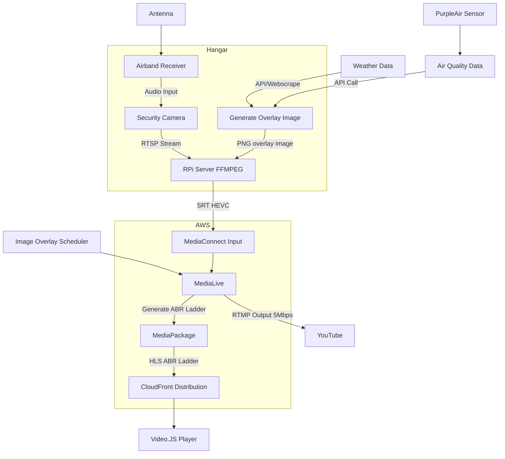

# airport-webcam
A simple webcam that overlays METAR and AQI data on video feed.

## Preview of Webcam
An example image from the webcam with METAR and AQI data overlayed on the video graphic

<picture>
  
</picture>

## Overview

## Security Camera (Video Source)
A security camera that is capable of generating RTSP video streams, along with Pan/Zoom/Tilt was used for this implementation.

## Airband Radio (CTAF Audio Source)
A Bearcat BC355C scanner radio, along with an external antenna and airband filter was selected for the radio source.
This was then tuned to the local Common Traffic Advisory Frequency (CTAF) to provide audio for the video feed.

## PurpleAir Sensor (AQI Data Source)
A PurpleAir sensor was mounted at the hangar to monitor the air quality.

## Weather Source (METAR Data)
There are several sources of local weather data. At some airports, an AWOS Net system is used. A list of US locations can be found here: http://awosnet.com/default.php
The AWOS Net system updates METAR data every 5 minutes, and can be accessed to provide data for the webcam feed.
Alternatively, data from NOAA can be used, though this is typically only updated every 60 minutes.

## Video Encoding and Distribution (AWS MediaServices)
The security camera generates an HEVC encoded video stream at approximately 3Mbps, which is then sent to AWS MediaServices for the generation of the HLS and YouTube feeds.
