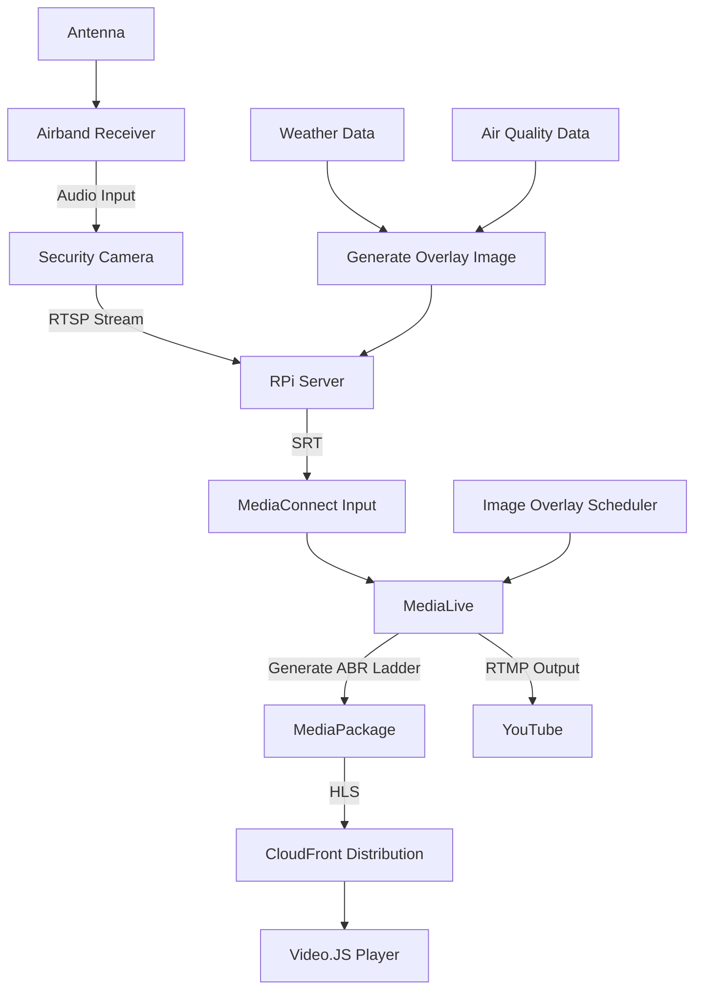

# airport-webcam
A simple webcam that overlays METAR and AQI data on video feed.

## Overview

```mermaid
graph TD;
  A[Antenna] --> B[Airband Receiver];
  C[Security Camera] --> |RTSP Stream| D[RPi Server];
  B --> |Audio Input| C;
  E[Weather Data] --> F[Generate Overlay Image];
  G[Air Quality Data] --> F;
F --> D;
D --> |SRT| H[MediaConnect Input];
H --> I[MediaLive];
K[Image Overlay Scheduler] --> I;
I --> |Generate ABR Ladder| J[MediaPackage];
I --> |RTMP Output| N[YouTube];
J --> |HLS| L[CloudFront Distribution];
L --> M[Video.JS Player];
```
